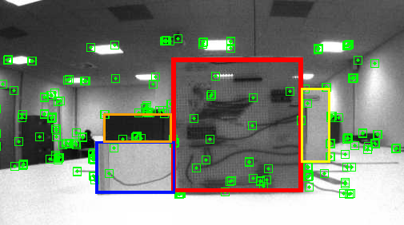
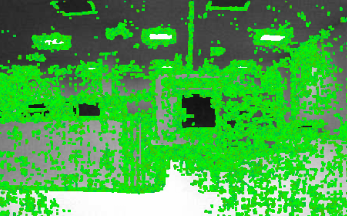

ROS navigation stack integration for Vector
===========================================

###### Guidelines to get Vector navigating a map, using ROS and goal planning from the navigation stack.

## The project


Vector is a social robot for the house and family, it has quite a lot of pre-build behaviors and interactions, such as voice control, face recognition, play with its cube… etc.

The aim is to integrate the navigation stack from ROS on this robot, using the SDK provided by the company.

## Robot setup requirements

First, the navigation need the robot to be configured for it, this requires:

* TF transformations, which is describing the link between coordinate frames.
* Odometry of the robot, the position of it to an absolute fixed frame.
* Base controller moving the robot around given a linear and angular velocity.
* Map server, this is a node publishing the map Vector will drive through.
* Sensor information, this can be either a LaserScan or a PointCloud message.

### TF transformation - [Source file](nodes/tf_publisher)

Publish the link between the laser scan (on the front of the robot) and the robot position (the center point of the robot), this is 1 cm offset along the x-axis. You need to be careful about which frame is the parent of the other one, I choose to take the robot as a parent of the laser scan, as it makes more sense than the inverse.

```python
br.sendTransform((0.01,0.0,0.0),
                 (0,0,0,1),
                 rospy.Time.now(),
                 "base_virtual_laser",
                 "base_link")
```

### Odometry information - [Source file](nodes/odom_publisher)

To publish the odometry I used the prebuilt function giving the robot pose in its map.

```python
robot_pose = robot.pose.position
robot_angle = robot.pose_angle_rad

nx = robot_pose.x/1000
ny = robot_pose.y/1000
nth = robot_angle
```

Then I publish the TF transform between the “odom” (fixed frame) and the robot.

```python
odom_quat = tf.transformations.quaternion_from_euler(0, 0, robot_angle)

br.sendTransform((nx, ny, 0.0),
                 odom_quat,
                 rospy.Time.now(),
                 "base_link",
                 "odom")
```

And finally I publish a ROS standart Odometry message.

```python
odom = Odometry()
odom.header.stamp = current_time
odom.header.frame_id = "odom"
odom.pose.pose = Pose(Point(nx, ny, 0.), Quaternion(*odom_quat))
# set the velocity
odom.child_frame_id = "base_link"
odom.twist.twist = Twist(Vector3(vx, vy, 0), Vector3(0, 0, vth))
odom_pub.publish(odom)
```

Be aware that where you place the robot will become the origin of the map. You could e.g use the charger as a base reference.

### Base controller - [Source file](nodes/base_controller)

To allow the navigation stack to drive the robot from A to B, it assumes that the robot has a ROS node subscribing to the “cmd_vel” topic. The program then waits for a Twist message (linear and angular velocity vectors) to come in and convert it into speed used by the “set_wheel_motors” function driving the robot wheels.

```python
vx = msg.linear.x * 1000                # Get forward speed command and convert from m to mm
vth = msg.angular.z                     # Get rotation speed command
vr = D*vth/2                            # Calculate the speed to apply to the wheels for the rotation

                                        # vr  is calculated based on trigonometric rotations
vd = vx + vr                            # so it should be added on the right wheel following the rotation
vl = vx - vr                            # and substract from the left still following the rotation

robot.motors.set_wheel_motors(vl,vd)     # Set the robot's wheels speed
```

### Map server

The map server is a node available with ROS, this handles the saving & loading of a global map or the loading of it so it’s available for the navigation stack. The map can be made using “gmapping” with the sensor, odometry and tf data (see ROS navigation tutorial).

### Sensor information - [Source file](nodes/laser_scan_publisher)

Our goal is to move safely around in an environment that might be changing. To avoid any obstacles we first need to detect them with the robot’s sensors. This is the trickiest part with Vector because the only sensor that we can use is a distance sensor in the front of the robot, which does not provide a lot of information.

### The difficulties

Cool everything is set up, except the sensing node, we need a laser scan or a point cloud. Vector is equipped with a laser scan used internal for its map but you can’t access it through the SDK.

#### Attempt #1


I use the map generated by Vector using its internal laser scanner, and simulate a scan by ray casting into the map. The map is stored as a quadtree data structure which made easier the ray casting. For the simulated scan, I started coding my function for casting a beam into the map, this returns the distance from the wall or the maximum distance the laser can scan can return base on Vector specification. This method generates a good laser scan, but the algorithm is slow, and Vector API as a lot of connection issues, so it’s not enough reliable for the mapping.

#### Attempt #2

Because we can’t rely on the laser scan, but we can access the image feed from the Vector camera, the idea was to use some Monocular SLAM (Simultaneous Localization And Mapping) algorithm. For the following algorithms, I need to have the calibration parameters of the camera. I used the “cameracalibrator.py” from the “camera_calibration” ROS package, with a checkerboard, so I could get the parameters needed as matrices. This is the command I used: “rosrun camera_calibration cameracalibrator.py --size 8x6 --square 0.108 image:=/vector/camera/image_raw”. Be aware that the topic I used for the image might not be the same for you.

---

I first started using “[*ORB SLAM 2*](https://github.com/raulmur/ORB_SLAM2)”, it’s a sparse Monocular SLAM Algorithm. Given the camera parameters and image feed, the algorithm builds a sparse map of the world. Using key points detected in the environment it reconstructs the movement and scale
using the differences between a small number of frames.
But because of the poor quality and low frame rate of the Vector camera, the algorithm was doing pretty bad. Mostly because it couldn’t extract good enough features (noisy non-static features) to identify across frames and then find the relation between several frames.
<p align="center">
  
</p>
Key features are not well extracted and there is a lot of noisy points, so the generated point cloud does not represent the environment which is made of four boxes.

<p align="center">
  
</p>

---

I tried another algorithm called “[*LSD SLAM*](https://github.com/tum-vision/lsd_slam)”, unlike the first one it’s a dense algorithm, which means that we should have a more understandable point cloud of the environment. This algorithm uses “rqt_reconfigure” for tuning of the parameters, all explained on [lsd_slam GitHub](https://github.com/tum-vision/lsd_slam#315-parameters-dynamic-reconfigure).After some experiment trying to tune the algorithm, I was able to get something that looks a bit like my environment.

<p align="center">
  
</p>

But the problem is that half of my points where noise. Moreover, point cloud messages are not standardized so you would need to convert it into a ROS standart PointCloud message.

<p align="center">
  
</p>

Eventually, I decided that whilst this approach was promising the algorithms were not good/reliable enough for mapping

### The solution - [Source file](map)


Because I couldn’t do the mapping for the navigation stack, I ended drawing the map by hand using GIMP. That way, I could keep going through the setup of the navigation, and make Vector drive around the map. I also created a YAML file specifying the map, with the resolution in meters per pixel and the absolute position of the bottom left corner. I then get back to my simulated laser scan for the localization part of the SLAM.

```YAML
image: map.pgm
resolution: 0.01
origin: [-1.1, -0.43, 0.0]
occupied_thresh: 0.65
free_thresh: 0.196
negate: 0
```

### Navigation stack setup

Now let’s get into the configuration of the navigation, we still have some files to write to set up the global/local costmap and the planner.

We have to write four YAML config files, needed for the setup of costmaps and robot control:

* Common configurations for both global and local costmaps. Here I defined the max scan range and the maximum distance for an obstacle to be added to the map. I also defined the footprint of the robot, it’s just basically a rectangle that covers Vector dimensions. We need to tell the map to add a minimum distance (inflation_radius) from the walls that the robot should keep. And finally we add a source for the sensor, that needs the frame in which the sensor is, the type of data published, and the topic it’s published.

```YAML
obstacle_range: 0.35
raytrace_range: 0.4
footprint: [[-0.015,-0.005],[0.015,-0.005],[0.015,0.005],[-0.015,0.005]]
inflation_radius: 0.01

observation_sources: vector/laser_scan

vector/laser_scan: {sensor_frame: base_virtual_laser, data_type: LaserScan, topic: vector/laser_scan, marking: true, clearing: true}
```
* The global costmap needs to know the global frame corresponding to the map in our case it’s “map”, the frame of the base of Vector that I called “base_link”, the publishing rate which is 1 Hz for me, and if the map is static which it is because it’s hand made.

```YAML
global_costmap:
  global_frame: map
  robot_base_frame: base_link
  update_frequency: 1.0
  static_map: true
```

* The local costmap also needs the global “odom” and robot “base_link” frames, a publishing rate which is 0.5 Hz. In this case, it’s not static and is a rolling window because we want the robot to avoid new obstacles or obstacles that as moved. The robot will use this local map for driving avoiding new obstacles. The width of the map and the resolution in meter per pixels should be given usually the same as the global map.

```YAML
local_costmap:
  global_frame: odom
  robot_base_frame: base_link
  update_frequency: 1.0
  publish_frequency: 0.5
  static_map: false
  rolling_window: true
  width: 1.0
  height: 1.0
  resolution: 0.01
```

* Then finally the local planner which define the min and max acceleration/velocity. You may need to set the controller frequency for low-frequency sensor input.

```YAML
controller_frequency: 1

TrajectoryPlannerROS:
  max_vel_x: 0.05
  min_vel_x: 0.005
  max_vel_theta: 0.5
  min_in_place_vel_theta: 0.1

  acc_lim_theta: 3.2
  acc_lim_x: 2.5
  acc_lim_y: 2.5

  holonomic_robot: true
```

We can create a launch file for loading every robot setup files, and we need to have a launch file for the navigation stack.

This file will run:

1. The map server, which will load the map and the parameters to make it available to the stack.
2. Then the AMCL which is the node used for localization recommended in the ROS navigation stack tutorial, it’s base on the Monte-Carlo localization approach.
3. Finally, we run the move base node loading all the YAML files, and which will later send velocity command to the robot.

```XML
<launch>
	<master auto="start"/>

	<!-- Run the map server -->
	<node name="map_server" pkg="map_server" type="map_server" args="$(find vector_ros)/map/map.yaml"/>

	 <!--- Run AMCL -->
	<include file="$(find amcl)/examples/amcl_diff.launch" />

	<node pkg="move_base" type="move_base" respawn="false" name="move_base" output="screen">
		<rosparam file="$(find vector_ros)/config/costmap_common_params.yaml" command="load" ns="global_costmap" />
		<rosparam file="$(find vector_ros)/config/costmap_common_params.yaml" command="load" ns="local_costmap" />
		<rosparam file="$(find vector_ros)/config/local_costmap_params.yaml" command="load" />
		<rosparam file="$(find vector_ros)/config/global_costmap_params.yaml" command="load" />
		<rosparam file="$(find vector_ros)/config/base_local_planner_params.yaml" command="load" />
	</node>
</launch>
```
